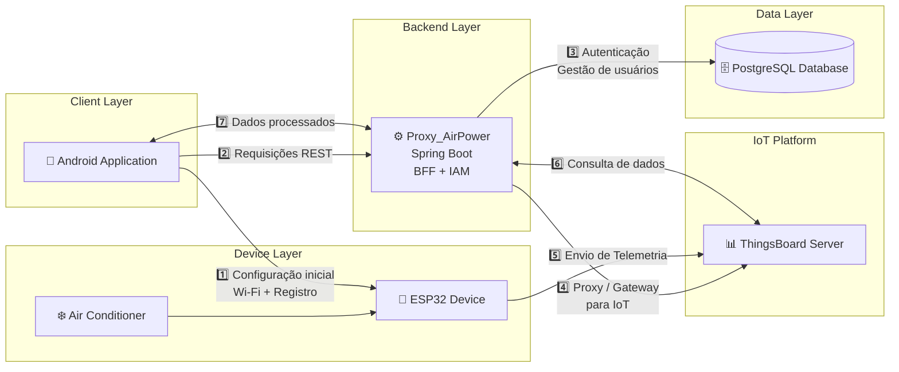

# 🌬️ AirPower Admin

Aplicativo móvel oficial desenvolvido para o projeto **AirPower**, responsável por atuar como a interface central de gestão para ambientes IoT baseados no **ThingsBoard**.

O aplicativo foi desenhado com uma arquitetura **100% nativa (sem WebViews)**, oferecendo uma experiência fluida para:

- **Provisionamento via Rede Local (Hotspot & Sockets TCP/UDP)**
- Controlo remoto de ar condicionado via RPC
- Análise gráfica de telemetria em tempo real

---

## 📋 Índice

- [🏗 Arquitetura do Sistema](#-arquitetura-do-sistema)
- [✨ Funcionalidades](#-funcionalidades)
- [🚀 Tecnologias Utilizadas](#-tecnologias-utilizadas)
- [📊 Dashboard Nativo IoT](#-dashboard-nativo-iot)
- [🛠 Aprovisionamento de Dispositivos](#-aprovisionamento-de-dispositivos)
- [🔌 Fluxo de Rede e BFF](#-fluxo-de-rede-e-bff)
- [📂 Estrutura do Projeto](#-estrutura-do-projeto)
- [🔧 Pré-requisitos](#-pré-requisitos)
- [⚙ Instalação & Downloads](#-instalação--downloads)
- [👨‍💻 Autores](#-autores)

---

## 🏗 Arquitetura do Sistema

O **AirPower Admin** segue o padrão **MVVM (Model-View-ViewModel)** com **State Hoisting** em Jetpack Compose.

O app **não se comunica diretamente com o ThingsBoard**, mas sim por meio de um **BFF (Backend for Frontend)** seguro.


---

### 🔹 Jetpack Compose (UI)

Responsável por:

- Interface reativa baseada em estados (**StateFlow**)
- Geração dinâmica de cartões de telemetria
- Renderização de gráficos temporais com **Vico**

---

### 🔹 Kotlin Coroutines & Provisioning Manager

Responsável por:

- Escanear placas ESP32 próximas
- Enviar SSID e senha Wi-Fi de forma segura
- Confirmar o registo do dispositivo no servidor proxy

---

### 🔹 Backend for Frontend (Proxy AirPower)

Responsável por:

- Validar o acesso do aplicativo
- Roteamento inteligente de telemetria
- Injeção do JWT no ThingsBoard

---

## ✨ Funcionalidades

### 🎛️ Controlo Remoto Bidirecional (RPC)

- Interface estilo Smart Home
- Comandos em tempo real:
    - Ligar/Desligar
    - Ajuste de temperatura
    - Modo
    - Velocidade do vento
- Sincronização em tempo real (**optimistic UI**)

---

### 📈 Análise Gráfica Nativa

- Gráficos temporais nativos
- Cruzamento de múltiplas métricas (ex: **Tensão vs Temperatura**)
- Uso de **Filter Chips**
- Controle de taxa de atualização

---

### 🗺️ Geolocalização e Mapeamento

- Mapa interativo com **Google Maps Compose**
- Rastreamento via telemetria GPS
- Marcadores vetoriais (**VectorDrawable**)

---

### 🛡️ Aprovisionamento Mágico

- Detecta dispositivos não configurados
- Envia credenciais automaticamente
- Regista o dispositivo no ThingsBoard no mesmo fluxo

---

## 🚀 Tecnologias Utilizadas

### 🎨 Frontend & UI

- Kotlin 1.9+
- Jetpack Compose (Material Design 3)
- Vico Compose

---

### ⚙ Arquitetura & Assincronismo

- MVVM
- Kotlin Coroutines
- StateFlow & SharedFlow

---

### 🌐 Networking & Persistência

- Retrofit 2 & OkHttp 3
- Room Database
- SharedPreferences

---

### 📍 Serviços de Localização

- Google Play Services (Fused Location)
- Maps Compose

---

## 📊 Dashboard Nativo IoT

Abandonamos o uso de WebViews do ThingsBoard devido a:

- Problemas de performance
- CORS
- Falhas de SSL em redes fechadas

### ✔ Nossa solução

- O app solicita dados ao **BFF**
- O **ViewModel** interpreta JSON dinamicamente:
    - `temperature`
    - `humidity`
    - `voltage`
- O **Compose** gera automaticamente a interface para cada sensor

---

## 🛠 Aprovisionamento de Dispositivos

### ♻️ Fluxo de configuração da ESP32 (100% Offline/Local via Sockets):

1. **Modo Hotspot:** O aplicativo instrui o utilizador a ativar o roteador Wi-Fi (Hotspot) do telemóvel com as credenciais padrão do sistema.
2. **Descoberta (UDP):** A ESP32 conecta-se ao Hotspot e emite um sinal de broadcast na rede. O Android "escuta" esta chamada e trava a comunicação com a placa.
3. **Transferência de Credenciais (TCP):** O aplicativo cria um servidor TCP nativo (Socket) e envia o nome da rede corporativa autorizada e a senha de forma segura para a ESP.
4. **Cloud Registry:** A placa reinicia, conecta-se à rede real e o aplicativo regista o dispositivo no ThingsBoard de imediato, associando as coordenadas GPS ao mesmo.

---

## 🔌 Fluxo de Rede e BFF

O aplicativo **nunca acessa diretamente o ThingsBoard**.

➡️ Toda a comunicação passa pelo **Proxy_AirPower**

---

# 📂 Estrutura do Projeto (Clean Architecture)

O projeto está dividido em três módulos principais para garantir a separação de responsabilidades, reutilização de código e escalabilidade:
```
📦 airpower_admin
┣ 📂 core/                        # ⚙️ Módulo de Baixo Nível (Hardware/Rede)
┃ ┗ 📂 src/main/java/.../core/
┃   ┣ 📂 api/                     # Sockets TCP/UDP, Hotspot e ConnectionManager
┃   ┗ 📂 contracts/               # Interfaces contratuais (ex: IConnectionManager)
┃
┣ 📂 common/                      # 🎨 Módulo de UI e Design System Compartilhado
┃ ┗ 📂 src/main/java/.../common/
┃   ┣ 📂 components/              # Botões base, Cards genéricos, Notificações
┃   ┣ 📂 contracts/               # Estados de UI (UIState, ChartDataWrapper)
┃   ┗ 📂 ui/theme/                # Cores, Tipografia, Dimensões (Material 3)
┃
┗ 📂 app/                         # 📱 Módulo Principal (Regras de Negócio e Telas)
┗ 📂 src/main/java/.../app/
┣ 📂 model/                   # Camada de Dados (Data Layer)
┃ ┣ 📂 provisioning/          # Lógica do assistente de Hotspot e Sockets (TCP/UDP)
┃ ┣ 📂 repository/            # Padrão Repository
┃ ┃ ┣ 📂 persistence/         # Banco Local (Room, Daos, JWTManager, SharedPreferences)
┃ ┃ ┗ 📂 remote/              # Retrofit, DTOs da API, Queries para o Proxy (BFF)
┃ ┗ 📂 util/                  # ResultWrapper, Logs e Tratamento de Exceções
┃
┣ 📂 view/                    # Camada de Apresentação (UI Layer)
┃ ┣ 📜 AdminActivity.kt       # Entry point principal
┃ ┣ 📜 AuthActivity.kt        # Entry point de autenticação
┃ ┗ 📂 ui/
┃   ┣ 📂 components/          # Componentes específicos (DeviceCard, EspSelection)
┃   ┗ 📂 screens/             # Telas em Compose (Dashboard, Mapa, Lista, Auth)
┃
┗ 📂 viewmodel/               # Camada de Gestão de Estado (State Holders)
┗ 📜 AdminViewModel.kt      # Gestão de telemetria, RPC e dispositivos
📜AirPowerApplication
```
---

## 🔧 Pré-requisitos

Para compilar:

- Android Studio Iguana ou superior
- Java JDK 17+
- Android 8.0+ (API 26)
- Dispositivo físico (BLE necessário)

---

## ⚙ Instalação & Downloads

### 📱 Usuários (APK)

1. Vá até a seção **Releases**
2. Baixe a versão mais recente  
   Ex: `AirPower-Admin-v1.0.0.apk`
3. Instale no Android (permitir fontes desconhecidas)

---

### 💻 Desenvolvedores

```bash
git clone <repo-url>
```
- Abra no Android Studio
- Aguarde o Gradle sincronizar
- Execute com Run ou gere APK em:
  -  `Build > Build Bundle / APK`

---

# 👨‍💻 Autores

**Davi Freitas**  
**Laboratório DEXTER / GPSERS**
